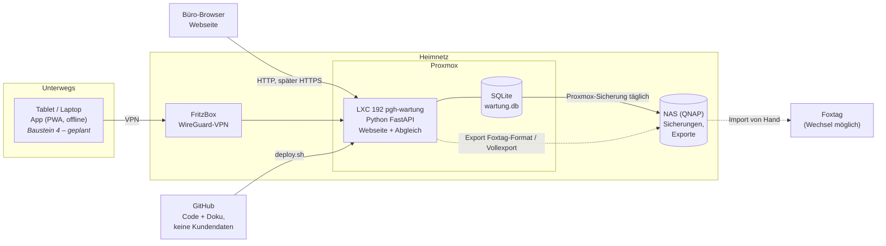
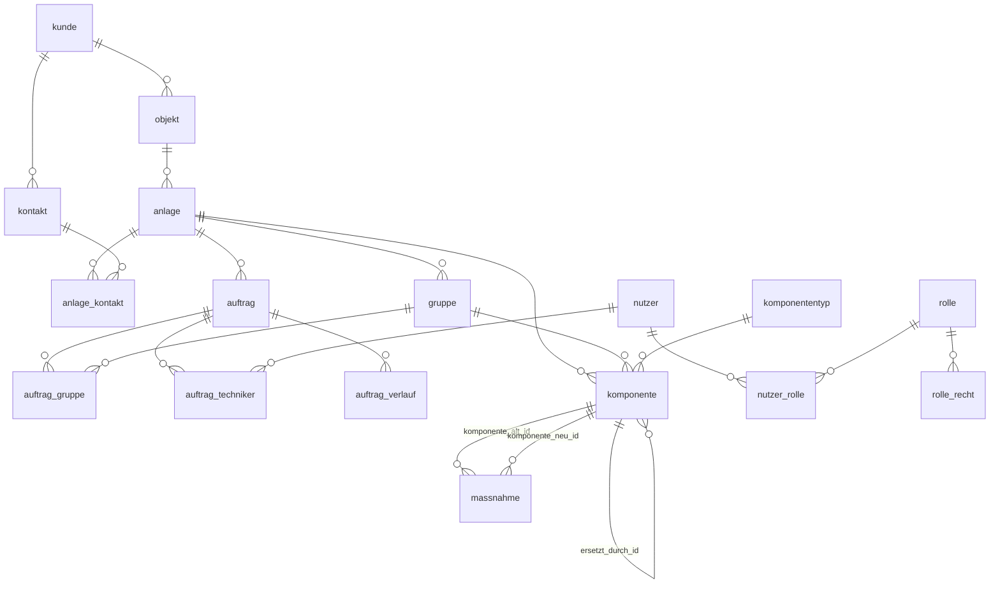
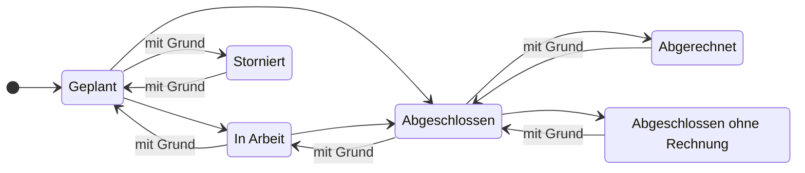
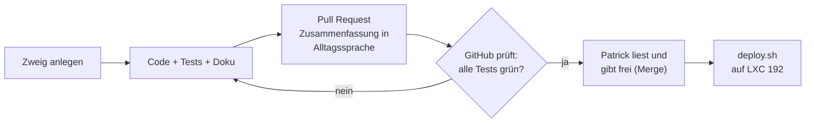

# Überblick – pgh-wartung auf einen Blick

Einstieg für Menschen: was es gibt, wie es zusammenhängt, wo wir stehen. Details stehen in den anderen `docs/`-Dateien.
Die Diagramme zeigt GitHub direkt als Bild an. Datenmodell und Auftragsstatus werden **automatisch aus dem Code
erzeugt** (`server/werkzeuge/diagramme.py`) und von den Tests geprüft – sie können also nicht veralten.

## 1. Wie die Teile zusammenhängen

Grundsätze, die überall gelten (Langfassung in `CLAUDE.md`): keine offenen Ports, Zugang nur über VPN; Kundendaten
nie im Repo oder Chat; Prüfnachweise werden nur angehängt, nie überschrieben; Löschen ist eine Markierung; jedes
Modul kann exportieren (eigener Vollexport und Foxtag-Format).

## 2. Stand der Bausteine

| # | Baustein | Stand | Version |
|---|---|---|---|
| 1 | Grundgerüst: Anmeldung, Nutzer, Rollen und Einzelrechte, Firma, Änderungsprotokoll | ✅ fertig | 0.1 |
| 2 | Stammdaten: Kunden, Objekte, Anlagen, Wohnungen, Melder, Fälligkeiten, Excel-Import, Export | ✅ fertig | 0.2 |
| 3 | Aufträge: planen, Liste und Woche, Sammelplanung, Start-Cockpit, Foxtag-Format | ✅ fertig | 0.3 |
| 4 | App (PWA) für Tablet/Laptop mit Offline-Abgleich – vorher HTTPS | ⏳ als Nächstes | – |
| 5 | Bericht als PDF, Terminankündigung/Aushang, Rechnungsübergabe | geplant | – |
| 6 | Mängel, Auswertungen, Ferninspektion; später Brandschutztüren als weitere Anlagenart | geplant | – |

Was sich je Version geändert hat: `CHANGELOG.md`. Tagesaktueller Stand und offene Punkte: `STATUS.md`.
Warum etwas so gebaut ist: `docs/09-entscheidungen.md`.

## 3. Datenmodell

Linien: eine Zeile auf der Seite mit dem Doppelstrich gehört zu vielen Zeilen auf der Seite mit dem Kreis und der Gabel
(z. B. ein Kunde hat viele Objekte). Sind zwei Tabellen mehrfach verknüpft, steht die Spalte an der Linie. Im Alltag: **Kunde → Objekt → Anlage → Wohnung (gruppe) → Melder (komponente)**;
Aufträge hängen an der Anlage. Feldbeschreibungen: `docs/03-datenmodell.md`.

<!-- AUTO:datenmodell -->

Ohne Verknüpfung (Verwaltung und Technik): `abgleich_zaehler`, `aenderungsprotokoll`, `anmeldeversuch`, `firma`, `nummernkreis`, `schema_version`.
<!-- /AUTO:datenmodell -->

## 4. Lebenslauf eines Auftrags

„Mit Grund“: Der Schritt ist nur mit einer Begründung möglich, die im Verlauf des Auftrags stehen bleibt.

<!-- AUTO:auftragsstatus -->

<!-- /AUTO:auftragsstatus -->

## 5. Wo was im Code liegt

| Ort | Inhalt |
|---|---|
| `server/wartung/` | Fachlogik je Thema: `kunden.py`, `objekte.py`, `anlagen.py`, `gruppen.py`, `komponenten.py`, `auftraege.py`, `export.py`, `excel_import.py`, `rechte.py` |
| `server/wartung/web/` | Webseiten je Bereich (Anzeige und Formulare; die Regeln stehen in der Fachlogik) |
| `server/wartung/templates/`, `static/` | Seitenvorlagen und Gestaltung |
| `server/wartung/migrationen/` | Datenbankschema, nummeriert; jede Änderung ist eine neue Datei |
| `server/wartung/konfig/` | Konfiguration je Anlagenart (Rauchwarnmelder; später Türen) |
| `server/tests/` | automatische Tests – laufen bei jedem Hochladen auf GitHub |
| `server/werkzeuge/` | Hilfsskripte (Diagramme, Probe-Import) |
| `deploy.sh` | spielt den Stand auf den Server ein (vorher laufen die Tests) |

## 6. So entsteht eine Änderung

